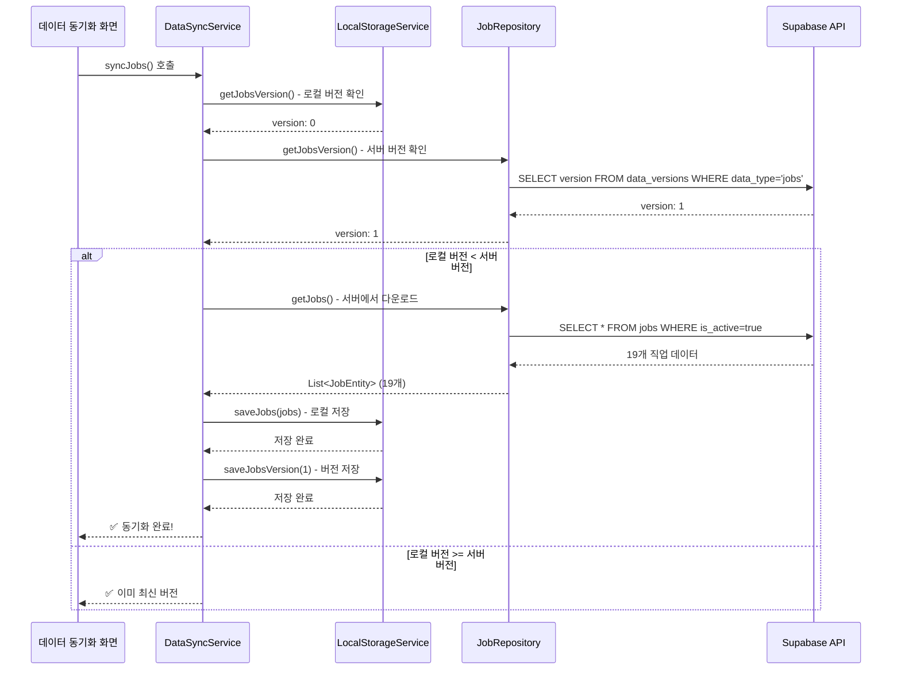
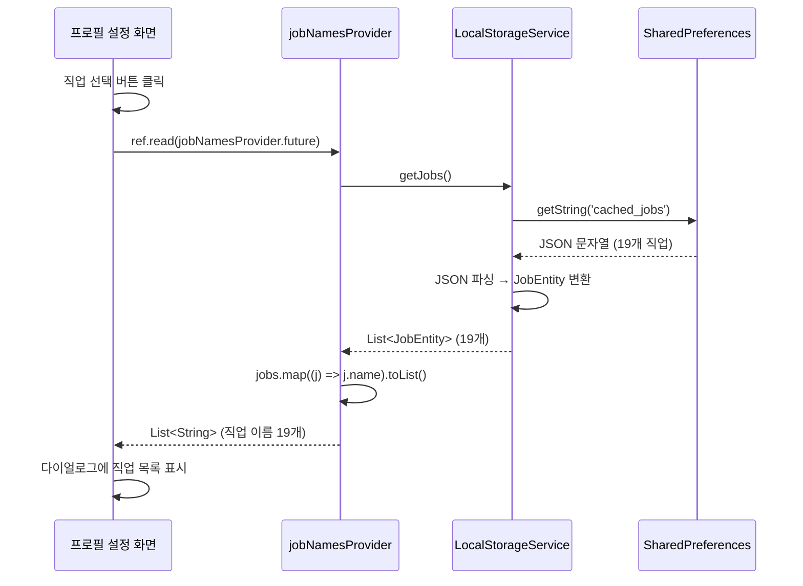
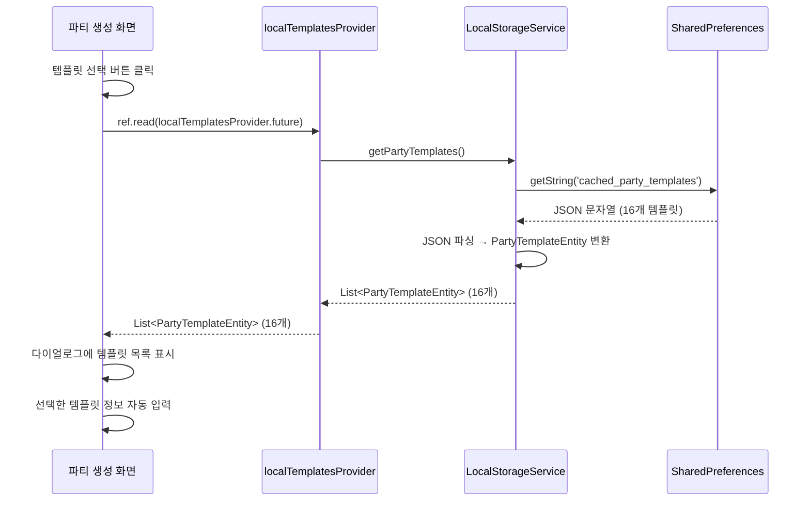
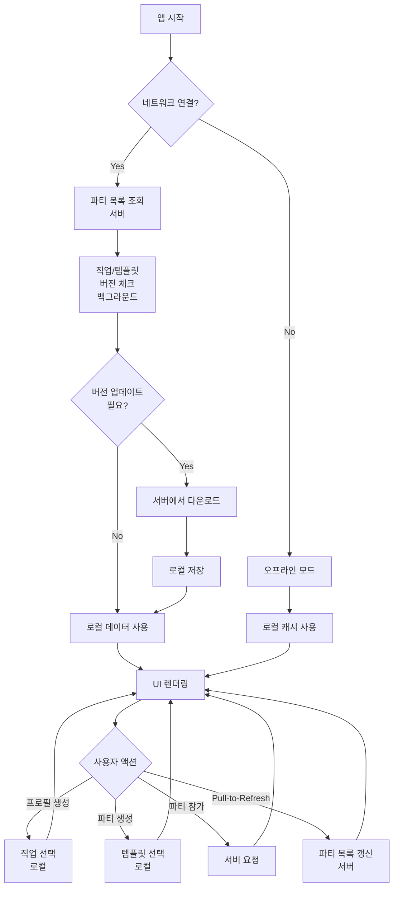

# 📡 서버 요청 로직 가이드

## 목차
1. [데이터 타입별 처리 방식](#데이터-타입별-처리-방식)
2. [현재 구현된 서버 요청 흐름](#현재-구현된-서버-요청-흐름)
3. [향후 구현 계획](#향후-구현-계획)
4. [API 엔드포인트](#api-엔드포인트)
5. [에러 처리](#에러-처리)

---

## 데이터 타입별 처리 방식

우리 앱은 **3가지 타입의 데이터**를 관리하며, 각각 다른 방식으로 서버와 통신합니다:

### 1. 파티 데이터 🎉

**특성**
- 실시간으로 변경되는 동적 데이터
- 사용자 간 공유가 필요한 데이터

**저장 위치**
- **서버**: Primary Storage (Supabase PostgreSQL)
- **로컬**: 저장하지 않음 (매번 서버에서 조회)

**요청 시점**
- 앱 시작 시
- 파티 목록 화면 진입 시
- Pull-to-Refresh 시
- 파티 생성/수정/삭제 후

**관련 테이블**
- `parties`: 파티 기본 정보
- `party_members`: 파티 참가자 정보

**요청 예시**
```dart
// 내가 참가한 파티 목록 조회
final parties = await partyRepository.getJoinedParties(userId);

// 내가 만든 파티 목록 조회
final myParties = await partyRepository.getMyParties(userId);

// 파티 생성
await partyRepository.createParty(party);

// 파티 수정
await partyRepository.updateParty(partyId, party);
```

---

### 2. 직업/템플릿 데이터 📦

**특성**
- 거의 변경되지 않는 정적 데이터
- 모든 사용자에게 동일한 데이터

**저장 위치**
- **서버**: Master Data (Supabase PostgreSQL)
- **로컬**: 캐시 (SharedPreferences)

**요청 시점**
- 앱 시작 시 (백그라운드, 자동)
- 수동 동기화 시 (설정 > 데이터 동기화)
- 주기적 동기화 (1시간마다, 백그라운드)

**버전 관리**
- `data_versions` 테이블로 버전 관리
- 로컬 버전 < 서버 버전 → 자동 업데이트

**관련 테이블**
- `jobs`: 직업 정보 (19개)
- `job_categories`: 직업 카테고리 (tank, dps, healer)
- `party_templates`: 파티 템플릿 (16개)
- `data_versions`: 버전 관리

**요청 예시**
```dart
// 1. 버전 확인
final localVersion = await LocalStorageService.getJobsVersion(); // 0
final serverVersion = await jobRepository.getJobsVersion();      // 1

// 2. 버전 비교 후 다운로드
if (serverVersion > localVersion) {
  final jobs = await jobRepository.getJobs();                    // 서버 요청
  await LocalStorageService.saveJobs(jobs);                      // 로컬 저장
  await LocalStorageService.saveJobsVersion(serverVersion);      // 버전 저장
}

// 3. UI에서 사용 (로컬에서만 읽기)
final jobs = await LocalStorageService.getJobs();                // 서버 요청 X
```

---

### 3. 프로필 데이터 👤

**특성**
- 사용자별 개인 데이터
- 서버 동기화 불필요 (로컬 전용)

**저장 위치**
- **서버**: 저장하지 않음
- **로컬**: SharedPreferences

**요청 시점**
- 서버 요청 없음 (완전 로컬)

**관련 파일**
- `lib/core/services/profile_service.dart`

**사용 예시**
```dart
// 프로필 저장
await ProfileService.addProfileToList(profile);

// 프로필 조회
final profiles = await ProfileService.getProfileList();

// 대표 프로필 설정
await ProfileService.setMainProfile(profileId);
```

---

## 현재 구현된 서버 요청 흐름

### 1단계: 앱 초기 실행

```
앱 시작 (main.dart)
    ↓
main_screen.dart 진입
    ↓
initState() 호출
    ↓
MockPartyData.syncPartyNotifications()
    ↓
Mock 파티 데이터에서 알림 등록
```

**⚠️ 현재 문제점**
- 실제 서버 요청이 없음
- Mock 데이터만 사용 중
- 실제 사용자의 파티 목록을 가져오지 않음

**📝 파일 위치**
- `lib/features/home/presentation/screens/main_screen.dart`
- `lib/core/data/mock_party_data.dart`

---

### 2단계: 수동 데이터 동기화 (직업/템플릿)

**사용자 액션**
```
설정 → 개발자 → 데이터 동기화 테스트 → "전체 데이터 동기화" 버튼 클릭
```

**서버 요청 흐름**



**코드 위치**
- `lib/core/services/data_sync_service.dart` - 동기화 로직
- `lib/core/services/local_storage_service.dart` - 로컬 저장/조회
- `lib/features/party/data/repositories/job_repository_impl.dart` - 서버 요청
- `lib/features/settings/presentation/screens/data_sync_test_screen.dart` - UI

**로그 예시**
```
🔄 직업 데이터 동기화 시작...
📱 로컬 직업 버전: 0
☁️ 서버 직업 버전: 1
⬇️ 서버에서 직업 데이터 다운로드 중...
✅ 직업 데이터 19개 다운로드 완료
✅ 직업 데이터 19개 로컬 저장 완료
✅ 직업 버전 1 저장 완료
🎉 직업 데이터 동기화 완료! (v0 → v1)
```

---

### 3단계: UI에서 데이터 사용 (로컬 캐시)

#### A. 프로필 생성/수정 - 직업 선택

**사용자 액션**
```
메인 화면 → 프로필 설정하기 → 직업 선택 클릭
```

**데이터 흐름**



**특징**
- ✅ 서버 요청 없음 (로컬에서만 읽기)
- ✅ 빠른 응답 속도
- ✅ 오프라인 지원

**코드 위치**
- `lib/features/party/presentation/providers/job_provider.dart` - Provider
- `lib/features/profile/presentation/widgets/profile_setup_bottom_sheet.dart` - UI

---

#### B. 파티 생성 - 템플릿 선택

**사용자 액션**
```
메인 화면 → + 버튼 → 파티 생성하기 → 템플릿 선택 클릭
```

**데이터 흐름**



**특징**
- ✅ 서버 요청 없음 (로컬에서만 읽기)
- ✅ 템플릿 선택 시 파티 정보 자동 입력
- ✅ 오프라인 지원

**코드 위치**
- `lib/features/party/presentation/providers/party_template_provider.dart` - Provider
- `lib/features/party/presentation/widgets/party_recruitment_bottom_sheet.dart` - UI

---

## 향후 구현 계획

### TODO 1: 앱 시작 시 자동 동기화

**목표**: 사용자가 수동으로 동기화하지 않아도 자동으로 최신 데이터 유지

**구현 위치**: `lib/features/home/presentation/screens/main_screen.dart`

```dart
@override
void initState() {
  super.initState();
  _initializeApp();
}

Future<void> _initializeApp() async {
  // 1. 직업/템플릿 자동 동기화 (백그라운드, 비동기)
  _syncStaticData();
  
  // 2. 실제 파티 데이터 가져오기 (서버)
  await _fetchPartyData();
  
  // 3. 알림 동기화
  _syncNotifications();
}

Future<void> _syncStaticData() async {
  // 백그라운드로 실행 (UI 블로킹 없음)
  final dataSyncService = DataSyncService(
    jobRepository: ref.read(jobRepositoryProvider),
    templateRepository: ref.read(partyTemplateRepositoryProvider),
  );
  
  // 비동기로 실행 (await 없음)
  dataSyncService.syncJobs();
  dataSyncService.syncTemplates();
}

Future<void> _fetchPartyData() async {
  // TODO: Mock 데이터 대신 실제 서버에서 가져오기
  final userId = await _getUserId();
  ref.read(partyListProvider.notifier).fetchParties(userId);
}
```

**예상 로그**
```
🚀 앱 시작...
🔄 백그라운드 데이터 동기화 시작...
📡 파티 목록 조회 중...
✅ 파티 목록 5개 조회 완료
🔔 알림 동기화 시작...
✅ 알림 5개 등록 완료
✅ 직업 데이터 이미 최신 (v1)
✅ 템플릿 데이터 이미 최신 (v1)
```

---

### TODO 2: 파티 목록 실제 서버 연동

**목표**: Mock 데이터 대신 Supabase에서 실제 파티 데이터 가져오기

**구현 위치**: `lib/features/party/presentation/providers/party_list_provider.dart`

```dart
@riverpod
class PartyListNotifier extends _$PartyListNotifier {
  @override
  Future<List<PartyEntity>> build() async {
    // 앱 시작 시 파티 목록 서버에서 가져오기
    return _fetchPartiesFromServer();
  }

  Future<List<PartyEntity>> _fetchPartiesFromServer() async {
    try {
      final userId = await _getUserId();
      
      // 1. 내가 참가한 파티 목록 가져오기
      final joinedPartiesResult = await ref.read(partyRepositoryProvider)
          .getJoinedParties(userId);
      
      final joinedParties = joinedPartiesResult.fold(
        (failure) {
          print('❌ 참가 파티 조회 실패: $failure');
          return <PartyEntity>[];
        },
        (parties) => parties,
      );
      
      // 2. 내가 만든 파티 목록 가져오기
      final myPartiesResult = await ref.read(partyRepositoryProvider)
          .getMyParties(userId);
      
      final myParties = myPartiesResult.fold(
        (failure) {
          print('❌ 내 파티 조회 실패: $failure');
          return <PartyEntity>[];
        },
        (parties) => parties,
      );
      
      // 3. 합쳐서 반환
      final allParties = [...joinedParties, ...myParties];
      print('✅ 파티 목록 ${allParties.length}개 조회 완료');
      
      return allParties;
    } catch (e) {
      print('❌ 파티 목록 조회 에러: $e');
      return [];
    }
  }

  // 파티 생성 시 서버에 저장
  Future<void> createParty(PartyEntity party) async {
    final result = await ref.read(partyRepositoryProvider).createParty(party);
    
    result.fold(
      (failure) => print('❌ 파티 생성 실패: $failure'),
      (createdParty) {
        print('✅ 파티 생성 성공: ${createdParty.name}');
        // 로컬 상태 업데이트
        state = AsyncValue.data([...state.value!, createdParty]);
      },
    );
  }

  // 새로고침
  Future<void> refresh() async {
    state = const AsyncValue.loading();
    state = await AsyncValue.guard(() => _fetchPartiesFromServer());
  }
}
```

**필요한 API**
- `GET /parties/joined/:userId` - 내가 참가한 파티
- `GET /parties/created/:userId` - 내가 만든 파티
- `POST /parties` - 파티 생성
- `PUT /parties/:partyId` - 파티 수정
- `DELETE /parties/:partyId` - 파티 삭제

---

### TODO 3: 주기적 데이터 동기화

**목표**: 백그라운드에서 주기적으로 직업/템플릿 버전 체크

**구현 위치**: `lib/core/services/background_sync_service.dart` (신규 생성)

```dart
class BackgroundSyncService {
  static Timer? _syncTimer;
  
  /// 주기적 동기화 시작 (1시간마다)
  static void startPeriodicSync({
    required WidgetRef ref,
    Duration interval = const Duration(hours: 1),
  }) {
    _syncTimer?.cancel();
    
    _syncTimer = Timer.periodic(interval, (timer) async {
      print('🔄 백그라운드 동기화 시작...');
      
      final dataSyncService = DataSyncService(
        jobRepository: ref.read(jobRepositoryProvider),
        templateRepository: ref.read(partyTemplateRepositoryProvider),
      );
      
      // 버전 체크 후 필요 시에만 다운로드
      await dataSyncService.syncJobs();
      await dataSyncService.syncTemplates();
      
      print('✅ 백그라운드 동기화 완료');
    });
  }
  
  /// 주기적 동기화 중지
  static void stopPeriodicSync() {
    _syncTimer?.cancel();
    _syncTimer = null;
  }
}

// main_screen.dart에서 사용
@override
void initState() {
  super.initState();
  
  // 백그라운드 동기화 시작
  BackgroundSyncService.startPeriodicSync(ref: ref);
}

@override
void dispose() {
  // 백그라운드 동기화 중지
  BackgroundSyncService.stopPeriodicSync();
  super.dispose();
}
```

---

### TODO 4: Pull-to-Refresh 구현

**목표**: 사용자가 화면을 당겨서 최신 파티 목록 갱신

**구현 위치**: `lib/features/home/presentation/screens/main_screen.dart`

```dart
Widget build(BuildContext context) {
  return RefreshIndicator(
    onRefresh: _handleRefresh,
    child: ListView(
      children: [
        // 파티 목록
      ],
    ),
  );
}

Future<void> _handleRefresh() async {
  print('🔄 Pull-to-Refresh 시작...');
  
  // 1. 파티 목록 갱신
  await ref.read(partyListProvider.notifier).refresh();
  
  // 2. 직업/템플릿 동기화 (백그라운드)
  final dataSyncService = DataSyncService(
    jobRepository: ref.read(jobRepositoryProvider),
    templateRepository: ref.read(partyTemplateRepositoryProvider),
  );
  
  dataSyncService.syncJobs();
  dataSyncService.syncTemplates();
  
  print('✅ Pull-to-Refresh 완료');
}
```

---

## API 엔드포인트

### 파티 관련 API

#### 1. 파티 목록 조회

**내가 참가한 파티**
```
GET /rest/v1/parties?select=*,party_members(*)&party_members.user_id=eq.{userId}
```

**내가 만든 파티**
```
GET /rest/v1/parties?creator_id=eq.{userId}
```

#### 2. 파티 생성
```
POST /rest/v1/parties
Content-Type: application/json

{
  "name": "마스던전 어비스 입문",
  "start_time": "2025-10-01T19:00:00Z",
  "max_members": 6,
  "content_type": "던전",
  "category": "레이드",
  "difficulty": "입문",
  "require_job": true,
  "require_power": true,
  "min_power": 700000,
  "max_power": 800000,
  "creator_id": "user_123"
}
```

#### 3. 파티 수정
```
PATCH /rest/v1/parties?id=eq.{partyId}
Content-Type: application/json

{
  "name": "마스던전 어비스 숙련",
  "difficulty": "숙련"
}
```

#### 4. 파티 삭제
```
DELETE /rest/v1/parties?id=eq.{partyId}
```

---

### 직업/템플릿 관련 API

#### 1. 버전 확인
```
GET /rest/v1/data_versions?data_type=eq.jobs&select=version
```

#### 2. 직업 목록 조회
```
GET /rest/v1/jobs?is_active=eq.true&select=*
```

#### 3. 템플릿 목록 조회
```
GET /rest/v1/party_templates?select=*
```

---

## 에러 처리

### 1. 네트워크 에러

**시나리오**: 인터넷 연결 없음

**처리 방법**
```dart
if (!await networkInfo.isConnected) {
  return Left(NetworkFailure(message: '인터넷 연결을 확인해주세요'));
}
```

**사용자 메시지**
```
⚠️ 인터넷 연결을 확인해주세요
- 로컬에 저장된 데이터를 사용합니다
```

---

### 2. 서버 에러

**시나리오**: Supabase API 에러 (500, 503 등)

**처리 방법**
```dart
try {
  final response = await supabaseClient.from('jobs').select();
  return Right(response);
} on PostgrestException catch (e) {
  return Left(ServerFailure(
    message: '서버 오류가 발생했습니다',
    code: e.code,
  ));
}
```

**사용자 메시지**
```
❌ 서버 오류가 발생했습니다
- 잠시 후 다시 시도해주세요
```

---

### 3. 로컬 캐시 없음

**시나리오**: 직업/템플릿 데이터가 로컬에 없음

**처리 방법**
```dart
final jobs = await LocalStorageService.getJobs();

if (jobs == null || jobs.isEmpty) {
  // 사용자에게 동기화 안내
  ScaffoldMessenger.of(context).showSnackBar(
    SnackBar(
      content: Text('직업 데이터가 없습니다. 설정에서 데이터 동기화를 진행해주세요.'),
      backgroundColor: Colors.orange,
      action: SnackBarAction(
        label: '동기화',
        onPressed: () {
          // 동기화 화면으로 이동
        },
      ),
    ),
  );
  return;
}
```

**사용자 메시지**
```
⚠️ 직업 데이터가 없습니다
- 설정에서 데이터 동기화를 진행해주세요
[동기화 버튼]
```

---

### 4. 버전 체크 실패

**시나리오**: 서버 버전 확인 실패

**처리 방법**
```dart
final serverVersionResult = await jobRepository.getJobsVersion();

return serverVersionResult.fold(
  (failure) {
    print('❌ 서버 버전 확인 실패: $failure');
    // 로컬 데이터 계속 사용
    return true;
  },
  (serverVersion) {
    // 버전 비교 로직
  },
);
```

**동작**
- 에러 무시하고 로컬 데이터 계속 사용
- 백그라운드에서 재시도

---

## 데이터 흐름 다이어그램

### 전체 흐름 (최종 구현 후)



---

## 캐시 전략

### 캐시 키

**직업 데이터**
- `cached_jobs`: 직업 목록 (JSON 문자열)
- `jobs_version`: 직업 버전 (int)
- `jobs_last_updated`: 마지막 업데이트 시간 (ISO 8601)

**템플릿 데이터**
- `cached_party_templates`: 템플릿 목록 (JSON 문자열)
- `templates_version`: 템플릿 버전 (int)
- `templates_last_updated`: 마지막 업데이트 시간 (ISO 8601)

### 캐시 무효화

**조건**
1. 서버 버전 > 로컬 버전
2. 마지막 업데이트 후 24시간 경과
3. 사용자가 수동으로 캐시 삭제

**무효화 방법**
```dart
// 직업 캐시 삭제
await LocalStorageService.clearJobsCache();

// 템플릿 캐시 삭제
await LocalStorageService.clearTemplatesCache();

// 모든 캐시 삭제
await LocalStorageService.clearAllCache();
```

---

## 성능 최적화

### 1. 백그라운드 동기화
- UI 블로킹 없이 데이터 동기화
- `await` 없이 비동기로 실행

### 2. 로컬 우선 전략
- UI 렌더링 시 로컬 데이터 먼저 표시
- 백그라운드에서 서버 데이터 갱신

### 3. 버전 기반 업데이트
- 불필요한 다운로드 방지
- 네트워크 트래픽 최소화

### 4. SharedPreferences 캐시
- 빠른 로컬 읽기 (메모리 캐시)
- 디스크 I/O 최소화

---

## 보안 고려사항

### 1. Row Level Security (RLS)

**파티 데이터**
```sql
-- 자신이 만든 파티만 수정/삭제 가능
CREATE POLICY "Users can update own parties"
ON parties FOR UPDATE
USING (auth.uid() = creator_id);

-- 자신이 참가한 파티만 조회 가능
CREATE POLICY "Users can view joined parties"
ON parties FOR SELECT
USING (
  auth.uid() = creator_id OR
  auth.uid() IN (
    SELECT user_id FROM party_members WHERE party_id = id
  )
);
```

### 2. API 인증

**Supabase Anonymous Auth**
```dart
final supabase = Supabase.instance.client;

// 익명 로그인
await supabase.auth.signInAnonymously();

// 이후 모든 요청은 자동으로 JWT 토큰 포함
```

---

## 관련 파일

### 서버 요청 관련
- `lib/core/services/data_sync_service.dart` - 동기화 서비스
- `lib/core/services/local_storage_service.dart` - 로컬 캐시
- `lib/features/party/data/repositories/job_repository_impl.dart` - 직업 API
- `lib/features/party/data/repositories/party_template_repository_impl.dart` - 템플릿 API
- `lib/features/party/data/datasources/job_remote_datasource.dart` - 직업 DataSource
- `lib/features/party/data/datasources/party_template_server_datasource.dart` - 템플릿 DataSource

### UI 관련
- `lib/features/settings/presentation/screens/data_sync_test_screen.dart` - 동기화 테스트 화면
- `lib/features/party/presentation/providers/job_provider.dart` - 직업 Provider
- `lib/features/party/presentation/providers/party_template_provider.dart` - 템플릿 Provider
- `lib/features/profile/presentation/widgets/profile_setup_bottom_sheet.dart` - 프로필 설정
- `lib/features/party/presentation/widgets/party_recruitment_bottom_sheet.dart` - 파티 생성

### 데이터 모델
- `lib/features/party/domain/entities/job_entity.dart` - 직업 Entity
- `lib/features/party/domain/entities/party_template_entity.dart` - 템플릿 Entity
- `lib/features/party/data/models/job_model.dart` - 직업 Model
- `lib/features/party/data/models/party_template_model.dart` - 템플릿 Model

---

## 버전 히스토리

### v1.0 (현재)
- ✅ 수동 데이터 동기화 구현
- ✅ 로컬 캐시 시스템 구현
- ✅ 버전 관리 시스템 구현
- ⏳ Mock 파티 데이터 사용 중

### v1.1 (계획)
- 🔜 앱 시작 시 자동 동기화
- 🔜 실제 파티 API 연동
- 🔜 Pull-to-Refresh 구현
- 🔜 백그라운드 주기적 동기화

---

## 문의

프로젝트 관련 문의사항은 개발팀에 연락하세요.

**Last Updated**: 2025-09-30
